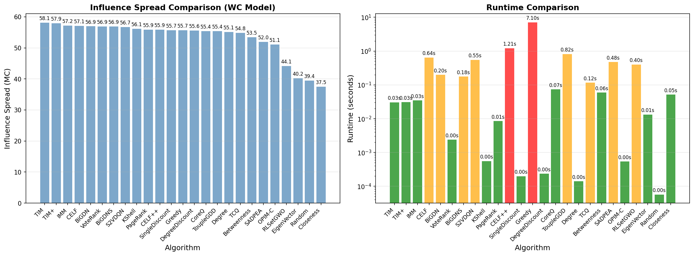

# PyNetIM

[](https://github.com/zzzkhj/PyNetIM)
[](https://pypi.org/project/pynetim/)
[](https://www.python.org/downloads/)
[](LICENSE)

[PyNetIM](https://zzzkhj.github.io/PyNetIM/) 是一个用于**社交网络影响力最大化（Influence Maximization, IM）问题**的 Python 库，集成了多种经典算法与扩散模型，提供 **C++ 高性能后端**，适用于算法研究、性能对比与科研实验。

***

## 简介

PyNetIM 提供完整的影响力最大化解决方案：

- **多种传播模型** - IC、LT、SI、SIR
- **多种 IM 算法** - 启发式、模拟类、RIS 类、深度强化学习
- **深度强化学习算法** - ToupleGDD、S2V-DQN、BiGDN、BiGDNS
- **评估指标** - 排名指标、影响力指标、种子质量指标、网络指标
- **时间测量** - 装饰器、AlgorithmTimer、多次运行统计
- **高性能 C++ 后端** - 比纯 Python 快 20-30 倍
- **自定义模型支持** - 支持用户自定义传播模型
- **权重管理** - 预训练权重自动下载与本地缓存
- **简洁 API** - 一行代码完成复杂任务

***

## 安装

```bash
pip install pynetim
```

**系统要求：**

- Python 3.8+（推荐 3.10+）
- C++17 编译器（GCC 8+, Clang 7+, MSVC 19.14+）

***

## 快速开始

```python
from pynetim import IMGraph, IndependentCascadeModel, IMMAlgorithm

# 1. 创建图
edges = [(0, 1), (1, 2), (2, 3), (3, 4), (4, 5)]
graph = IMGraph(edges, weights=0.3)

# 2. 使用 IMM 算法选择种子节点
imm = IMMAlgorithm(graph, model='IC', epsilon=0.5)
seeds = imm.run(k=2)
print(f"种子节点: {seeds}")

# 3. 评估影响力
model = IndependentCascadeModel(graph, set(seeds))
avg_influence = model.run_monte_carlo_diffusion(1000, use_multithread=True, num_threads=4)
print(f"平均影响力: {avg_influence:.2f}")
```

***

## 核心功能

### 图结构

```python
from pynetim import IMGraph

# 从边列表创建
graph = IMGraph(edges, weights=0.3)

# 统一权重
graph = IMGraph(edges, weights=0.1)

# 逐边权重
graph = IMGraph(edges, weights=[0.1, 0.2, 0.3, ...])

# 查询邻居（仅节点ID）
for neighbor in graph.out_neighbors(node):
    print(f"邻居: {neighbor}")

# 查询邻居（带权重）
for neighbor, weight in graph.out_neighbors_with_weights(node):
    print(f"邻居: {neighbor}, 权重: {weight}")
```

### 随机图生成

```python
from pynetim.graph import generate_er_graph, generate_ba_graph, generate_ws_graph

# ER 随机图 (G(n, p) 模型)
graph = generate_er_graph(n=1000, p=0.01, random_seed=42)

# BA 无标度网络 (优先连接机制)
graph = generate_ba_graph(n=1000, m=3, random_seed=42)

# WS 小世界网络 (重连边机制)
graph = generate_ws_graph(n=1000, k=4, beta=0.1, random_seed=42)
```

### 边权重设置

```python
from pynetim.graph import set_edge_weights, set_wc_weights, set_edge_weights_dict

# 通用函数设置权重
set_edge_weights(graph, "const", const_value=0.1)
set_edge_weights(graph, "wc")

# 直接调用具体函数
set_wc_weights(graph)

# 通过字典设置
weights = {(0, 1): 0.1, (1, 2): 0.2, (2, 3): 0.3}
set_edge_weights_dict(graph, weights)
```

| 函数                    | 说明                              |
| ----------------------- | --------------------------------- |
| `set_edge_weights`      | 通用边权重设置函数                 |
| `set_const_weights`     | 设置常数边权重                     |
| `set_tv_weights`        | 从列表中随机选择边权重             |
| `set_uniform_weights`   | 设置均匀分布边权重                 |
| `set_wc_weights`        | 设置 WC 模型边权重（权重 = 1/入度） |
| `set_edge_weights_dict` | 通过字典设置边权重                 |

### 传播模型

| 模型                                  | 说明     | 使用场景      |
| ----------------------------------- | ------ | --------- |
| `IndependentCascadeModel`           | 独立级联模型 | 社交网络传播    |
| `LinearThresholdModel`              | 线性阈值模型 | 观点传播      |
| `SusceptibleInfectedModel`          | SI 模型  | 疫情传播      |
| `SusceptibleInfectedRecoveredModel` | SIR 模型 | 疫情传播（含恢复） |

```python
from pynetim import IndependentCascadeModel, LinearThresholdModel, SusceptibleInfectedModel, SusceptibleInfectedRecoveredModel

# IC 模型
model = IndependentCascadeModel(graph, seeds={0, 1})
count = model.run_single_simulation()

# LT 模型
lt_model = LinearThresholdModel(graph, seeds={0, 1})
count = lt_model.run_single_simulation()

# SI 模型（需要显式提供 beta 和 max_steps）
si_model = SusceptibleInfectedModel(graph, seeds={0, 1}, beta=0.1, max_steps=100)
count = si_model.run_single_simulation()

# SIR 模型（需要显式提供 beta 和 gamma）
sir_model = SusceptibleInfectedRecoveredModel(graph, seeds={0, 1}, beta=0.1, gamma=0.05)
count = sir_model.run_single_simulation()

# 蒙特卡洛模拟（多线程）
avg = model.run_monte_carlo_diffusion(1000, use_multithread=True, num_threads=4)

# 记录激活节点
model = IndependentCascadeModel(graph, seeds, record_activated=True)
count = model.run_single_simulation()
activated = model.get_activated_nodes()
```

### 影响力最大化算法

| 算法                               | 类型     | 特点                  | 参考文献                                |
| -------------------------------- | ------ | ------------------- | ----------------------------------- |
| `RLSetGWOAlgorithm`              | 进化算法   | 灰狼优化 + 强化学习         | Roayaei, SN Comput. Sci., 2026      |
| `CoreQAlgorithm`                 | 强化学习   | K-core + Q-learning | Ahmad & Wang, Expert Syst. Appl., 2025 |
| `TCQAlgorithm`                   | 强化学习   | 目标节点影响力最大化          | Ahmad & Wang, Neurocomputing, 2025  |
| `BiGDNAlgorithm`                 | 深度强化学习 | 端到端图神经网络 + DQN      | Zhu et al., Expert Syst. Appl., 2025 |
| `BiGDNSAlgorithm`                | 深度强化学习 | BiGDN 学生模型，知识蒸馏     | Zhu et al., Expert Syst. Appl., 2025 |
| `SADPEAAlgorithm`                | 进化算法   | 双概率进化算法             | Li et al., Inf. Sci., 2025          |
| `ToupleGDDAlgorithm`             | 深度强化学习 | 三重门控图神经网络 + DQN     | Chen et al., IEEE TCSS, 2024        |
| `OPIMAlgorithm`                  | OPIM 类 | 可证明近似保证             | Tang et al., SIGMOD, 2018           |
| `OPIMCAlgorithm`                 | OPIM 类 | 自适应采样版本             | Tang et al., SIGMOD, 2018           |
| `S2VDQNAlgorithm`                | 深度强化学习 | Structure2Vec + DQN | Dai et al., NeurIPS, 2017           |
| `VoteRankAlgorithm`              | 启发式    | 投票机制，避免聚集           | Zhang et al., Sci. Rep., 2016       |
| `IMMAlgorithm`                   | RIS 类  | 大规模图首选              | Tang et al., SIGMOD, 2015           |
| `TIMAlgorithm`                   | RIS 类  | 两阶段影响力估计            | Tang et al., SIGMOD, 2014           |
| `TIMPlusAlgorithm`               | RIS 类  | TIM 优化版             | Tang et al., SIGMOD, 2014           |
| `BaseRISAlgorithm`               | RIS 类  | 基础反向影响采样            | Borgs et al., Data Min. Knowl. Discov., 2012 |
| `CELFPlusAlgorithm`              | 模拟类    | CELF 优化版            | Goyal et al., WWW, 2011             |
| `KShellDecompositionAlgorithm`   | 启发式    | K-shell 分解          | Kitsak et al., Nat. Phys., 2010     |
| `SingleDiscountAlgorithm`        | 启发式    | 速度快                 | Chen et al., KDD, 2009              |
| `DegreeDiscountAlgorithm`        | 启发式    | 速度快，效果好             | Chen et al., KDD, 2009              |
| `CELFAlgorithm`                  | 模拟类    | 精度高，比贪婪快            | Leskovec et al., KDD, 2007          |
| `GreedyAlgorithm`                | 模拟类    | 精度高，速度慢             | Kempe et al., KDD, 2003             |
| `PageRankAlgorithm`              | 启发式    | 经典 PageRank         | Brin & Page, Comput. Netw., 1998    |
| `BetweennessCentralityAlgorithm` | 启发式    | 介数中心性               | Freeman, Sociometry, 1977           |
| `EigenvectorCentralityAlgorithm` | 启发式    | 特征向量中心性             | Bonacich, J. Math. Sociol., 1972    |
| `ClosenessCentralityAlgorithm`   | 启发式    | 接近中心性               | Sabidussi, Psychometrika, 1966      |
| `DegreeCentralityAlgorithm`      | 启发式    | 度中心性，最快             | -                                   |

```python
from pynetim import DegreeDiscountAlgorithm, GreedyAlgorithm, IMMAlgorithm, OPIMCAlgorithm
from pynetim.algorithms import (
    PageRankAlgorithm, VoteRankAlgorithm,
    CoreQAlgorithm, TCQAlgorithm,
    RLSetGWOAlgorithm, SADPEAAlgorithm
)

# 启发式算法（快）
algo = DegreeDiscountAlgorithm(graph)
seeds = algo.run(k=10)

# PageRank 算法
algo = PageRankAlgorithm(graph, damping=0.85)
seeds = algo.run(k=10)

# VoteRank 算法（避免种子聚集）
algo = VoteRankAlgorithm(graph)
seeds = algo.run(k=10)

# 模拟类算法（精确）
algo = GreedyAlgorithm(graph, model='IC', num_trials=1000)
seeds = algo.run(k=10)

# RIS 算法（大规模图）
algo = IMMAlgorithm(graph, model='IC', epsilon=0.5)
seeds = algo.run(k=10)

# OPIM-C 算法（自适应采样，可证明近似保证）
algo = OPIMCAlgorithm(graph, model='IC', random_seed=42, verbose=True)
seeds = algo.run(k=10, epsilon=0.3)

# 强化学习算法
algo = CoreQAlgorithm(graph, n_candidates=50, episodes=100)
seeds = algo.run(k=10)

# 目标节点影响力最大化
target_nodes = {1, 5, 10, 15, 20}
algo = TCQAlgorithm(graph, target_nodes=target_nodes, n_candidates=50, episodes=100)
seeds = algo.run(k=10)

# 进化算法
algo = RLSetGWOAlgorithm(graph, pop_size=20, max_iter=30)
seeds = algo.run(k=10)

algo = SADPEAAlgorithm(graph, pop_size=20, max_iter=30, random_seed=42)
seeds = algo.run(k=10)
```

### 深度强化学习算法

PyNetIM 集成了基于深度强化学习的影响力最大化算法：

| 算法                   | 类型     | 特点                   | 参考文献                                |
| -------------------- | ------ | -------------------- | ----------------------------------- |
| `ToupleGDDAlgorithm` | 深度强化学习 | 三重门控图神经网络 + DQN      | Chen et al., IEEE TCSS 2024         |
| `S2VDQNAlgorithm`    | 深度强化学习 | Structure2Vec + DQN  | Dai et al., NeurIPS 2017            |
| `BiGDNAlgorithm`     | 深度强化学习 | 端到端图神经网络 + DQN（教师模型） | Zhu et al., Expert Syst. Appl. 2025 |
| `BiGDNSAlgorithm`    | 深度强化学习 | BiGDN 学生模型，支持知识蒸馏    | -                                   |

**预训练权重**：库内置了论文作者公开的预训练权重，设置 `pretrained=True` 即可自动加载。用户也可通过 `weights_path` 参数指定自己的权重文件。

```python
from pynetim import IMGraph
from pynetim.algorithms import (
    ToupleGDDAlgorithm, S2VDQNAlgorithm,
    BiGDNAlgorithm, BiGDNSAlgorithm
)

# 创建图
graph = IMGraph(edges, weights=0.3)

# ToupleGDD
algo = ToupleGDDAlgorithm(graph, pretrained=True, device='cpu')
seeds = algo.run(k=10)

# S2V-DQN
algo = S2VDQNAlgorithm(graph, pretrained=True)
seeds = algo.run(k=10)

# BiGDN
algo = BiGDNAlgorithm(graph, pretrained=True)
seeds = algo.run(k=10)

# BiGDNS（学生模型）
algo = BiGDNSAlgorithm(graph, pretrained=True)
seeds = algo.run(k=10)
```

#### 训练深度强化学习模型

```python
from pynetim.algorithms import (
    ToupleGDDTrainer, S2VDQNTrainer,
    BiGDNTrainer, BiGDNNodeEncoderTrainer
)

# ToupleGDD 训练
trainer = ToupleGDDTrainer(device='auto')
trainer.train(graphs=[graph], budget=10, num_epochs=100, save_path='model.ckpt')

# S2V-DQN 训练
trainer = S2VDQNTrainer(device='auto')
trainer.train(graphs=[graph], budget=10, num_epochs=100, save_path='model.ckpt')

# BiGDN 训练（需要先预训练 NodeEncoder）
ne_trainer = BiGDNNodeEncoderTrainer(num_features=64, device='auto')
ne_trainer.train(graphs=train_graphs, num_epochs=100, save_path='encoder.pth')

trainer = BiGDNTrainer(num_features=64, device='auto', encoder_path='encoder.pth')
trainer.train(graphs=[graph], budget=10, num_epochs=100, save_path='model.pth')

# BiGDNS 训练（需要教师模型权重进行知识蒸馏）
trainer = BiGDNTrainer(num_features=64, device='auto',
                       teacher_path='bigdn_weights.pth', is_student=True)
trainer.train(graphs=[graph], budget=10, num_epochs=100, save_path='bigdns_weights.pth')
```

**注意**：深度强化学习算法需要安装额外依赖：

```bash
pip install pynetim[deep-learning]
```

### 自定义传播模型

PyNetIM 提供两种自定义模型基类：

| 基类                               | 特点         | 适用场景      |
| -------------------------------- | ---------- | --------- |
| `BaseCallbackDiffusionModel`     | C++ 回调，单线程 | 简单模型      |
| `BaseMultiprocessDiffusionModel` | 多进程并行      | 需要加速的复杂模型 |

```python
from pynetim.diffusion_model import BaseMultiprocessDiffusionModel

class MyICModel(BaseMultiprocessDiffusionModel):
    """自定义 IC 模型。"""
    
    def run_single_trial(self, seeds, random_seed):
        import random
        random.seed(random_seed)
        
        activated = set(seeds)
        current = list(seeds)
        
        while current:
            new_active = []
            for node in current:
                for neighbor, weight in self.graph.out_neighbors_with_weights(node):
                    if neighbor not in activated and random.random() < weight:
                        activated.add(neighbor)
                        new_active.append(neighbor)
            current = new_active
        
        return len(activated), activated, [0] * self.graph.num_nodes

# 使用自定义模型
model = MyICModel(graph, {0, 1})
avg = model.run_monte_carlo_diffusion(1000, num_processes=4)
```

### 评估指标

PyNetIM 提供完整的评估指标模块，用于评估影响力最大化算法的性能：

```python
from pynetim.evaluation import (
    kendall_tau,
    monotonicity_score,
    top_k_accuracy,
    average_shortest_distance,
    degree_statistics,
)

# 排名相关性评估
tau, p = kendall_tau(ranking1, ranking2)

# 单调性评估（区分节点重要性的能力）
mono = monotonicity_score(importance_scores)

# Top-K 准确率
acc = top_k_accuracy(predicted_seeds, ground_truth_seeds, k=10)

# 种子节点分布评估
avg_dist = average_shortest_distance(graph, seeds)
stats = degree_statistics(graph, seeds)
```

### 时间测量

支持多种时间测量方式：

```python
from pynetim.timing import measure_time, AlgorithmTimer

# 装饰器方式
@measure_time
def my_algorithm(graph, k):
    return seeds

seeds, runtime = my_algorithm(graph, k=10)

# AlgorithmTimer 类
timer = AlgorithmTimer(algorithm)
seeds, runtime = timer.run(k=10, mc_rounds=1000, random_seed=42)

# 多次运行统计
stats = timer.run_multiple(k=10, num_runs=5)
print(f"Mean: {stats['mean']:.4f}s, Std: {stats['std']:.4f}s")
```

***

## 性能对比

测试环境：Intel Xeon Platinum 8255C @ 2.50GHz, 3.6GB RAM, Ubuntu 24.04 LTS, Python 3.10.20

| 模型                             | 并行度  | 耗时    | 说明        |
| ------------------------------ | ---- | ----- | --------- |
| C++ IC                         | 1 线程 | 0.30s | 基准（最快）    |
| C++ IC                         | 4 线程 | 0.38s | 多线程加速     |
| BaseCallbackDiffusionModel     | 1 线程 | 6.6s  | 单线程可用     |
| BaseCallbackDiffusionModel     | 4 线程 | 6.9s  | ⚠️ GIL 限制 |
| BaseMultiprocessDiffusionModel | 1 进程 | 6.2s  | 单进程       |
| BaseMultiprocessDiffusionModel | 4 进程 | 3.7s  | ✅ 真正并行    |

***

## 算法对比

我们对比了 PyNetIM 中 25 种影响力最大化算法的性能。

### 实验环境

| 项目         | 配置                                  |
| ---------- | ----------------------------------- |
| **CPU**    | Intel Xeon Platinum 8255C @ 2.50GHz |
| **内存**     | 3.6GB RAM                           |
| **操作系统**   | Ubuntu 24.04 LTS                    |
| **Python** | 3.10.20                             |
| **设备**     | CPU only（无 GPU）                     |

### 参数设置

| 参数              | 值                    | 说明                       |
| --------------- | -------------------- | ------------------------ |
| **网络类型**        | Erdős-Rényi (ER) 随机图 | 度分布均匀，适合公平对比             |
| **节点数**         | 200                  | 中等规模网络                   |
| **边概率**         | 0.02                 | 稀疏网络                     |
| **边权重**         | WC 模型                | p(u,v) = 1/in\_degree(v) |
| **种子数 k**       | 10                   | 选择 10 个种子节点              |
| **MC 轮数**       | 1000                 | 蒙特卡洛模拟次数                 |
| **RIS epsilon** | 0.1                  | RIS 算法精度参数               |
| **深度强化学习设备**    | CPU                  | 无 GPU 加速                 |

### 对比算法

| 类型         | 算法                                                                                                      | 数量     |
| ---------- | ------------------------------------------------------------------------------------------------------- | ------ |
| **模拟类**    | Greedy, CELF, CELF++                                                                                    | 3      |
| **RIS 类**  | IMM, TIM, TIM+, OPIM-C                                                                                  | 4      |
| **启发式**    | Degree, PageRank, VoteRank, KShell, Betweenness, Closeness, EigenVector, SingleDiscount, DegreeDiscount | 9      |
| **强化学习**   | CoreQ, TCQ                                                                                              | 2      |
| **进化算法**   | RLSetGWO, SADPEA                                                                                        | 2      |
| **深度强化学习** | BiGDN, BiGDNS, ToupleGDD, S2VDQN                                                                        | 4      |
| **基准**     | Random                                                                                                  | 1      |
| **总计**     | -                                                                                                       | **25** |

### 实验结果



### 结果分析

| 排名 | 算法             | 影响力   | 运行时间  | 类型     |
| -- | -------------- | ----- | ----- | ------ |
| 1  | TIM            | 58.10 | 0.03s | RIS    |
| 2  | TIM+           | 57.93 | 0.03s | RIS    |
| 3  | IMM            | 57.18 | 0.03s | RIS    |
| 4  | CELF           | 57.09 | 0.64s | 模拟     |
| 5  | BiGDN          | 56.94 | 0.20s | 深度强化学习 |
| 6  | VoteRank       | 56.91 | 0.00s | 启发式    |
| 7  | BiGDNS         | 56.88 | 0.18s | 深度强化学习 |
| 8  | S2VDQN         | 56.67 | 0.55s | 深度强化学习 |
| 9  | KShell         | 56.15 | 0.00s | 启发式    |
| 10 | PageRank       | 55.87 | 0.01s | 启发式    |
| 11 | CELF++         | 55.86 | 1.21s | 模拟     |
| 12 | SingleDiscount | 55.69 | 0.00s | 启发式    |
| 13 | Greedy         | 55.65 | 7.10s | 模拟     |
| 14 | DegreeDiscount | 55.58 | 0.00s | 启发式    |
| 15 | CoreQ          | 55.41 | 0.07s | 强化学习   |
| 16 | ToupleGDD      | 55.38 | 0.82s | 深度强化学习 |
| 17 | Degree         | 55.13 | 0.00s | 启发式    |
| 18 | TCQ            | 54.82 | 0.12s | 强化学习   |
| 19 | Betweenness    | 53.47 | 0.06s | 启发式    |
| 20 | SADPEA         | 51.95 | 0.48s | 进化算法   |
| 21 | OPIM-C         | 51.07 | 0.00s | RIS    |
| 22 | RLSetGWO       | 44.11 | 0.40s | 进化算法   |
| 23 | EigenVector    | 40.21 | 0.01s | 启发式    |
| 24 | Random         | 39.42 | 0.00s | 基准     |
| 25 | Closeness      | 37.50 | 0.05s | 启发式    |

***

## 项目结构

```
src/pynetim/
├── __init__.py
├── graph/                    # 图结构
│   ├── IMGraph               # 图类
│   ├── generators.py         # 随机图生成
│   ├── weights.py            # 边权重设置
│   └── decomposition.py      # 图分解（K-shell）
├── diffusion_model/          # 传播模型
│   ├── IndependentCascadeModel
│   ├── LinearThresholdModel
│   ├── SusceptibleInfectedModel
│   ├── SusceptibleInfectedRecoveredModel
│   ├── BaseCallbackDiffusionModel      # C++ 回调版
│   └── BaseMultiprocessDiffusionModel  # 多进程版
├── algorithms/               # IM 算法
│   ├── BaseAlgorithm         # 算法基类
│   ├── simulation/           # 模拟类算法
│   │   ├── GreedyAlgorithm
│   │   ├── CELFAlgorithm
│   │   └── CELFPlusAlgorithm
│   ├── heuristic/            # 启发式算法
│   │   ├── DegreeCentralityAlgorithm
│   │   ├── PageRankAlgorithm
│   │   ├── VoteRankAlgorithm
│   │   ├── KShellDecompositionAlgorithm
│   │   ├── BetweennessCentralityAlgorithm
│   │   ├── ClosenessCentralityAlgorithm
│   │   ├── EigenvectorCentralityAlgorithm
│   │   ├── SingleDiscountAlgorithm
│   │   └── DegreeDiscountAlgorithm
│   ├── ris/                  # RIS 类算法
│   │   ├── BaseRISAlgorithm
│   │   ├── IMMAlgorithm
│   │   ├── TIMAlgorithm
│   │   ├── TIMPlusAlgorithm
│   │   ├── OPIMAlgorithm
│   │   └── OPIMCAlgorithm
│   ├── reinforcement_learning/  # 强化学习算法
│   │   ├── BaseRLAlgorithm
│   │   ├── CoreQAlgorithm
│   │   ├── TCQAlgorithm
│   │   └── deep/             # 深度强化学习
│   │       ├── BaseDRLAlgorithm
│   │       ├── ToupleGDDAlgorithm
│   │       ├── S2VDQNAlgorithm
│   │       ├── BiGDNAlgorithm
│   │       └── BiGDNSAlgorithm
│   ├── population/           # 进化算法
│   │   ├── BasePopulationAlgorithm
│   │   ├── RLSetGWOAlgorithm
│   │   └── SADPEAAlgorithm
│   └── deep_learning/        # 深度学习（预留）
├── evaluation/               # 评估指标
│   ├── ranking_metrics       # 排名指标
│   ├── influence_metrics     # 影响力指标
│   ├── seed_quality_metrics  # 种子质量指标
│   └── network_metrics       # 网络指标
├── timing/                   # 时间测量
│   ├── measure_time          # 装饰器
│   └── AlgorithmTimer        # 计时器类
├── weights/                  # 权重管理
│   └── WeightManager         # 预训练权重下载与缓存
├── utils/                    # 工具函数
└── py/                       # Python 实现（维护模式）
```

***

## 开发指南

### 运行测试

```bash
# 运行所有测试
python -m pytest tests/

# 运行特定测试
python tests/test_diffusion_comparison.py
```

### 贡献代码

1. Fork 本仓库
2. 创建特性分支 (`git checkout -b feature/AmazingFeature`)
3. 提交更改 (`git commit -m 'Add some AmazingFeature'`)
4. 推送到分支 (`git push origin feature/AmazingFeature`)
5. 开启 Pull Request

***

## 更新日志

查看 [CHANGELOG.md](CHANGELOG.md) 了解版本历史。

***

## 许可证

本项目采用 MIT 许可证 - 详见 [LICENSE](LICENSE) 文件。

***

## 致谢

感谢以下对本项目提供帮助的个人和工具：

- **TraeAI** - 提供了强大的 AI 辅助开发环境，显著提升了代码开发效率和问题解决能力
- **GLM-5** - 智谱 AI 大语言模型，在代码开发、调试优化和文档编写过程中提供了重要帮助

